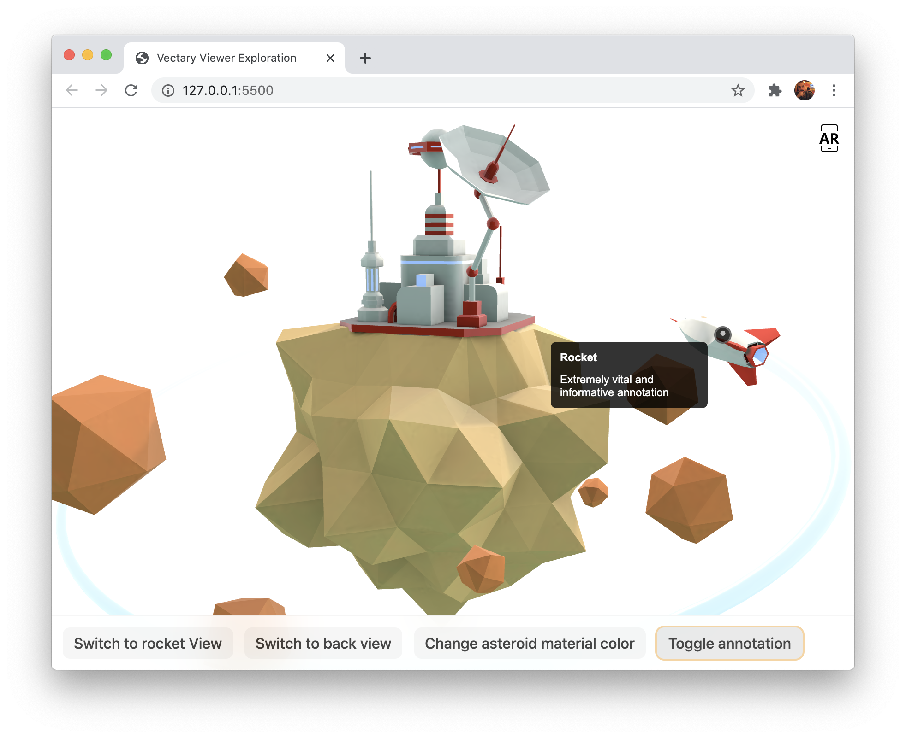

# Exploring the Vectary Viewer API

Basic project built to explore the [Vectary Viewer API](https://vectary.github.io/viewer-api/#/). Running live
[right here](https://quirky-hawking-7243e5.netlify.app).

> To run it locally, simply [download the project](https://github.com/AgustinBrst/vectary-viewer/archive/main.zip),
> extract it, and run `npx serve` from a terminal inside the project folder. Opening any of the presented locations in a
> browser will do.

**Features explored**

- Changing the active camera.
- Changing material colors.
- Adding and expanding/closing annotations
